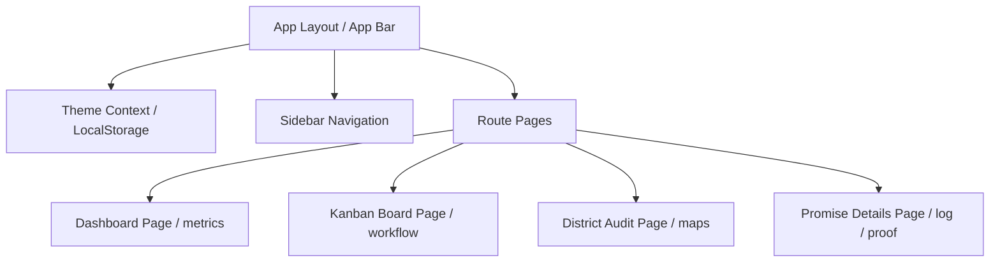

# Architectural Overview

NammaArasu (நம்ம அரசு) is a modern, responsive web application built with a premium, institutional design philosophy for civic accountability.

## Component Architecture

## Core Modules & Layers

### 1. Presentation Layer (Frontend)
* **Framework**: Next.js (App Router, Server-rendered on demand / prerendered statics).
* **Styling**: TailwindCSS (v4 @import standard) coupled with custom global design variables for glassmorphism and modern layouts.
* **Component System**: Modular and theme-adaptive components (`Header.tsx`, `Sidebar.tsx`, `InteractiveMap.tsx`, `StatusBadge.tsx`, `PriorityBadge.tsx`).

### 2. State & Persistence Layer
* **Service**: `src/lib/db.ts` exposes a high-fidelity mock service (`promiseService`) designed with seamless fallback logic.
* **Storage**: Toggles seamlessly between loaded static JSON data sheets (`tvk_aram_framework.json`, etc.) and `localStorage` to preserve citizen evidence submissions and admin workflow transitions directly inside the browser.

### 3. Design Tokens (globals.css)
* **Variable Tokens**: Configured semantic colors dynamically updated when `.light` class is added/removed on the root HTML document:
  * `--background`: Core canvas fill.
  * `--card`: Floating surfaces.
  * `--border`: Dynamic borders.
  * `--muted`: Subdued secondary fills.
