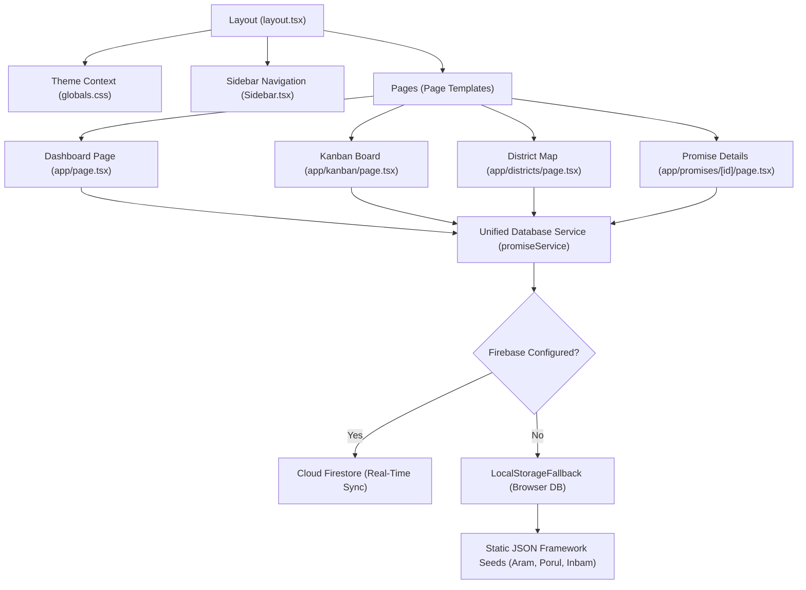

# Technical Architecture

NammaArasu (நம்ம அரசு) is a production-grade, highly responsive web application built with a premium, institutional design philosophy for civic accountability. This document outlines the system architecture, component relationships, and data sync layers.

---

## Architecture Diagram

The diagram below illustrates how core views, layout contexts, and the data sync layers interact:

---

## Architectural Layers

### 1. Presentation Layer (Next.js 16)

The application uses the Next.js App Router model to deliver fast, optimized pages.

- **Dynamic Page Rendering**: Detail and analytics pages fetch metadata on-demand.
- **Routing Structure**:
  - `src/app/page.tsx`: Core metrics, KPI blocks, and global promise listings.
  - `src/app/districts/`: TAMIL NADU administrative regional SVG maps and localized analytics.
  - `src/app/kanban/`: Admin JIRA-Style board to transition states and record gazettes.
  - `src/app/promises/[id]/`: Granular proof audit hub, citizen uploads, and timeline logs.
- **Layouts & SEO**: Head wraps and viewport layouts are structured inside `src/app/layout.tsx` to handle responsive viewports and configure proper, single-H1 semantic hierarchies.

### 2. Styling System (TailwindCSS v4 + Vanilla CSS Variables)

The styling system combines TailwindCSS's utility classes with a highly structured custom-variable design system in `src/app/globals.css`.

- **Semantic Theming**: The theme shifts seamlessly when `.light` class is toggled on the root document. No HEX or RGB values are hardcoded in the codebase.
- **Theme Variables**:
  - `--background`: Primary canvas fill.
  - `--card`: Raised surface panels.
  - `--border`: Fine borders for outlines and cards.
  - `--muted`: Secondary subdued backgrounds.
- **Glassmorphism & Opacity**: Utilizes custom gradients, blurs, and alpha-opacity variables to build sleek, high-contrast, professional badges and headers.

### 3. Data Persistence & Service Layer

The application implements a unique, zero-config resilient sync layer defined in `src/lib/db.ts` (`promiseService`).

- **Firebase Sync**: When `NEXT_PUBLIC_FIREBASE_PROJECT_ID` is configured, `promiseService` directly connects to Google Firestore to fetch dynamic status updates, comments, and citizen evidence.
- **Zero-Config Local Fallback Mode**: If environment variables are blank, the engine automatically initializes inside the user's browser using `localStorage`. It pre-seeds itself with the official TVK manifesto JSON documents:
  - `tvk_aram_framework.json` (Ethics)
  - `tvk_porul_framework.json` (Wealth)
  - `tvk_inbam_framework.json` (Joy)
- **Self-Healing Sync Engines**: When syncing with Firebase, `promiseService` automatically prunes orphaned or testing documents that do not match our strict manifesto structures, keeping the live cloud database in perfect sync with local templates.

---

## Future Scalability Considerations

NammaArasu is designed to allow future scaling without needing a full architectural overhaul:

1. **Multilingual Support**: Fully prepped to introduce Next.js Internationalization (i18n) for instant English/Tamil localization.
2. **Public REST APIs**: The structured signatures in `promiseService` can be easily converted into Next.js Route Handlers (`api/promises/route.ts`) to serve public data feeds for journalists and researchers.
3. **Map Layers**: The interactive SVG map is modularly isolated and ready to accept GeoJSON overlays for tracking district-wise agricultural, budgetary, or industrial metrics.
